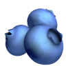
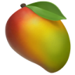
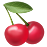
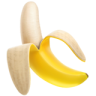
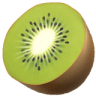
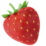
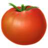

# Emoji Token Assets
## On Winston

* 🫐[Blueberries](./#Blueberries) 
* 🥭[Mango](./#Mango) 
* 🍒[Cherries](./#Cherries) 
* 🍌[Banana](#Banana) 
* 🥝[Kiwi](#Kiwi) 
* 🍓[Stawberries](#Strawberries) 
* 🍅[Tomato](#Tomato) 
---
Basic information.
| Qty | Name | Fruit Image | WAC Cost | Current Supply |
|-----|------|-------------|----------|----------------|
|100|Blueberries| | 0.00000000000001|∞|
|100|Mango|| 0.000000000000000001 | ∞ |
|100|Cherries|| 0.000000000000000001|∞|
|100|Banana|| 0.000000000000000001|∞|
|100|Kiwi|| 0.000000000000000001|∞|
|100|Strawberries| |0.0000000000000001|∞|
|100|Tomato|| 0.000000000000000001|∞|

---    
## 🫐Blueberries
The Blueberries token is a part of the Winston fruit collection. Blueberries are used to feed Ahwa, traded for experience, or traded for other assets. Use your Blueberries to keep your Ahwa happy and healthy. Have a bit extra and want to trade them? You can use your balance in the Winston Fruit store to trade for other fruit and/or experience that can be used with in the various parts of Winston Services. 

#### Contract Address
> 0x 

Blueberry Stats
```JSON
{
    "exp": 1,
    "health": 1,
    "happiness": .05,
    "loyalty": .1
}
```

---
## 🥭Mango

The Mango token is a part of the Winston fruit collection. Mango are used to feed Ahwa, traded for experience, or traded for other assets. Use your Mango to keep your Ahwa happy and healthy. Have a bit extra and want to trade them? You can use your balance in the Winston Fruit store to trade for other fruit and/or experience that can be used with in the various parts of Winston Services. 

#### Contract Address
> 0x 


Mango Stats
```JSON
{
    "exp": .001,
    "health": .0005,
    "happiness": .0005,
    "loyalty": .0001
}
```
---
## 🍒Cherries

The Cherries token is a part of the Winston fruit collection. Cherries are used to feed Ahwa, traded for experience, or traded for other assets. Use your Cherries to keep your Ahwa happy and healthy. Have a bit extra and want to trade them? You can use your balance in the Winston Fruit store to trade for other fruit and/or experience that can be used with in the various parts of Winston Services. 

#### Contract Address
> 0x 


Cherries Stats
```JSON
{
    "exp": .001,
    "health": .0005,
    "happiness": .0005,
    "loyalty": .0001
}
```
---
## 🍌Banana

The Banana token is a part of the Winston fruit collection. Banana are used to feed Ahwa, traded for experience, or traded for other assets. Use your Banana to keep your Ahwa happy and healthy. Have a bit extra and want to trade them? You can use your balance in the Winston Fruit store to trade for other fruit and/or experience that can be used with in the various parts of Winston Services.

#### Contract Address
> 0x 


Banana Stats
```JSON
{
    "exp": .001,
    "health": .0005,
    "happiness": .0005,
    "loyalty": .0001
}
```
---
## 🥝Kiwi

The Kiwi token is a part of the Winston fruit collection. Kiwi are used to feed Ahwa, traded for experience, or traded for other assets. Use your Kiwi to keep your Ahwa happy and healthy. Have a bit extra and want to trade them? You can use your balance in the Winston Fruit store to trade for other fruit and/or experience that can be used with in the various parts of Winston Services. 

#### Contract Address
> 0x 


Kiwi Stats
```JSON
{
    "exp": .001,
    "health": .0005,
    "happiness": .0005,
    "loyalty": .0001
}
```
---
## 🍓Strawberries

The Stawberries token is a part of the Winston fruit collection. Stawberries are used to feed Ahwa, traded for experience, or traded for other assets. Use your Stawberries to keep your Ahwa happy and healthy. Have a bit extra and want to trade them? You can use your balance in the Winston Fruit store to trade for other fruit and/or experience that can be used with in the various parts of Winston Services. 

#### Contract Address
> 0x 

Strawberry Stats
```JSON
{
    "exp": .001,
    "health": .0005,
    "happiness": .0005,
    "loyalty": .0001
}
```
---
## 🍅Tomato

The Tomato token is a part of the Winston fruit collection. Tomato are used to feed Ahwa, traded for experience, or traded for other assets. Use your Tomato to keep your Ahwa happy and healthy. Have a bit extra and want to trade them? You can use your balance in the Winston Fruit store to trade for other fruit and/or experience that can be used with in the various parts of Winston Services. 

#### Contract Address
> 0x 

Tomato Stats
```JSON
{
    "exp": .001,
    "health": .0005,
    "happiness": .0005,
    "loyalty": .0001
}
```
