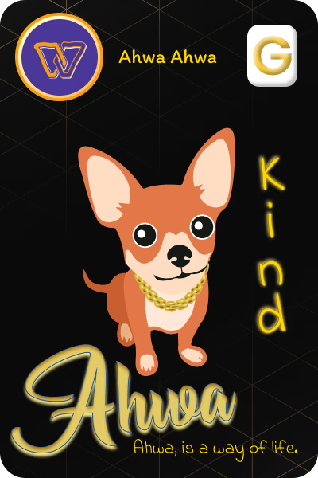

# Ahwa Values

### Kind

<figure><figcaption></figcaption></figure>

Ahwa is a way of life. Every Ahwa is kind.



### Courteous

<figure><figcaption></figcaption></figure>

Ahwa is a way of life. Every Ahwa is courteous.



### Polite

<figure><figcaption></figcaption></figure>

Ahwa is a way of life. Every Ahwa is polite!



### Trust Worthy

<figure><figcaption></figcaption></figure>

Ahwa is a way of life. Every Ahwa is Trust Worthy!



### Loyalty

<figure><figcaption></figcaption></figure>

Ahwa is a way of life. Every Ahwa is a loyal friend to the common person.



### Honor

<figure><figcaption></figcaption></figure>

Ahwa is a way of life. Every Ahwa lives with honor.



### Love

<figure><figcaption></figcaption></figure>

Ahwa is a way of life. Every Ahwa has love in their heart.



### Friendly

<figure><figcaption></figcaption></figure>

Ahwa is a way of life. Every Ahwa is friendly!



### Compassionate

<figure><figcaption></figcaption></figure>

Ahwa is a way of life. Every Ahwa is compassionate!



