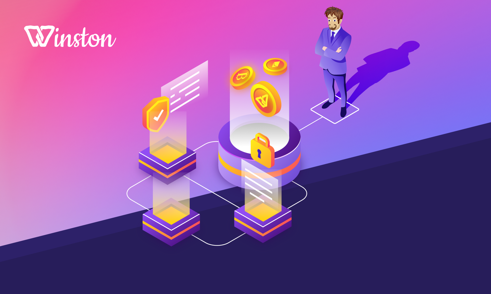
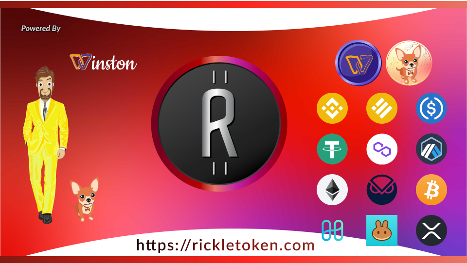

# Welcome to Winston Crypto

<figure><figcaption>
Winston Crypto
</figcaption></figure>

[Winston Crypto on Discord](https://discord.gg/rickle-897546129108008960)

## Winston Crypto Overview

### **Winston Crypto** is a decentralized finance (DeFi) project that operates across multiple blockchain networks, including Ethereum, Binance Smart Chain, Polygon, and Arbitrum. The project focuses on providing seamless asset movement and liquidity across these networks.

### Introduction

#### **Winston Crypto: Revolutionizing Multi-Chain Asset Movement**

Winston Crypto is set to redefine the landscape of digital finance by introducing a cutting-edge platform that facilitates seamless asset movement across multiple blockchain networks. In doing so, it enhances both liquidity and accessibility for users worldwide. This robust infrastructure not only bolsters the ease of transactions but also cements Winston Crypto's position as a pivotal player in the evolving blockchain ecosystem.

#### **Enhanced Liquidity and Accessibility**

One of Winston Crypto's core missions is to amplify liquidity and make digital assets more accessible to users. By allowing transactions across various blockchain networks, users can effortlessly move their assets without being confined to a single platform, thereby maximizing the efficiency of their digital transactions. This approach democratizes access to digital assets, encouraging a broader range of participants in the blockchain environment.

#### **Innovative Multi-Chain Approach**

Leveraging an innovative multi-chain approach, Winston Crypto ensures that transactions are not only efficient but also secure. By supporting interoperability among diverse platforms, it eliminates the traditional barriers that have hindered cross-platform asset exchange. This strategic framework fosters an environment where users can confidently engage in transactions, knowing their assets are protected by top-tier security measures.

#### **Arbitration and MEV Exchanges**

In addition to facilitating seamless asset transfers, Winston Crypto introduces unique opportunities for arbitration and Maximum Extractable Value (MEV) exchanges through its proprietary assets. This capability allows users to participate in complex market strategies, such as arbitration, thus creating additional streams of value. These processes are fine-tuned to integrate within Winston Crypto's ecosystem, further enhancing the strategic value behind the academy coin.

#### **Community and Rewards**

At the heart of Winston Crypto is its vibrant community of users. The platform not only seeks to connect individuals through transactions but also fosters a network where users are rewarded for their participation. This reward system is designed to incentivize engagement and ensure that all stakeholders benefit from the platform's growth and success.

#### **Conclusion**

Winston Crypto is a leader in blockchain innovation, providing a flexible and secure platform to improve asset liquidity and accessibility. By adopting a multi-chain strategy, supporting arbitration and MEV exchanges, and fostering a reward-focused community, Winston Crypto is poised to excel in the dynamic field of decentralized finance.

<figure><figcaption>
Winston your personal assistant to all things blockchain.
</figcaption></figure>

## Key Features

### **Rickle Token (RKL)**:

* **Multi-Chain Currency**: Designed for seamless asset transfer across multiple blockchains.
* **Gateway Token**: Provides access to other ecosystem assets, like Winston.
* **Liquidity and Market Access**: Its presence on multiple chains enhances liquidity, offering versatile opportunities for

### Winston Token (WIN)

* **Rewards Token**: Winston serves as a rewards token within the ecosystem, connecting Rickle and Ahwa.
* **Deflationary Mechanism**: A portion of Winston tokens are permanently locked in a contract, reducing the circulating supply over time.

### **Ahwa Token (AHWA)**:

* **Governance Token**: Ahwa is used exclusively for voting within the Winston ecosystem. It allows users to participate in governance decisions, influencing the future direction of the project.

### **Winston Academy Coin (WAC)**:

* **Educational Incentives**: WAC is funded in part by the use of Rickle and Winston tokens. It is the asset used in the "Learn to Earn" academy being built by Winston Crypto. This academy aims to provide educational incentives, rewarding users for participating in learning activities.

<figure><figcaption></figcaption></figure>

## Benefits of the Ecosystem

The integration of Ahwa, Winston, and Rickle tokens within the Winston Crypto ecosystem offers a myriad of benefits that collectively enhance user experience and support the platform's sustainable growth:

* **User Empowerment**: Through Ahwa's governance capabilities, users have a voice in shaping the project's future, ensuring that development aligns with community needs and interests.
* **Incentivized Learning**: The "Learn to Earn" initiative, powered by WAC, encourages users to invest in their education, offering rewards for acquiring new skills and knowledge.
* **Token Interoperability**: The seamless interaction between Ahwa, Winston, and Rickle tokens fosters a cohesive ecosystem, enabling efficient resource utilization and streamlined processes.
* **Value Appreciation**: With mechanisms like the deflationary approach of Winston tokens, the network ensures scarcity and potential value growth, benefitting long-term token holders.
* **Community Engagement**: The reward structures facilitated by Winston and Rickle tokens incentivize active participation, driving a thriving, collaborative community unwavering in its pursuit of the common goal.

This comprehensive integration of tokens not only fortifies the ecosystem's functionality but also underlines a commitment to fostering innovation and continuous development, vital for meeting the evolving demands of the decentralized finance landscape.

<figure><figcaption>
Rickle [rkl]  (rkl, brkl, prkl, arkl, xrkl) 
</figcaption></figure>

### Rickle (RKL)

Rickle stands as a pioneering force in the realm of cross-chain trading, revolutionizing the way transactions are executed across multiple blockchain networks. It accomplishes this by employing an innovative 1:1 bridge, which seamlessly connects six distinct chains. This unique feature ensures a smooth and integrated trading experience for users, providing unparalleled access to liquidity—a critical component for implementing sophisticated trading strategies. By supporting over 80 different trading pools, Rickle significantly expands the scope of possibilities for traders, allowing them to navigate expansive market opportunities with ease.

The platform's strategic focus is on major cryptocurrency pairs, specifically targeting those that include highly liquid and widely-used coins such as USDC, USDT, POL, BNB, ETH, and WBTC. By concentrating on these key assets, Rickle not only facilitates efficient arbitration opportunities across its widespread network but also empowers traders to maximize their trading potential by capitalizing on price differentials. This meticulous curation of trading pairs ensures that users can engage in high-volume, high-efficiency transactions that take full advantage of current market conditions.

Beyond trading efficiencies, the architecture of the Rickle ecosystem is thoughtfully designed to support sustained growth and innovation. One of its pivotal roles is to underpin the funding mechanism for the academy token, driving forward educational initiatives and community engagement. By harnessing increased liquidity and strategically focusing on valuable trading pairs, Rickle bolsters its ecosystem, fostering an environment where educational endeavors are prioritized, and active participation is consistently incentivized. This multi-pronged approach ensures that Rickle not only maintains its position as a leading platform for cross-chain liquidity but also emerges as a cornerstone of community development and pioneering advancements in the blockchain sector.

<figure><figcaption>
Winston [WIN]
</figcaption></figure>

### Winston (WIN)

Winston stands as a powerful embodiment of our vision for collective success, representing a beacon of hope and opportunity within the sphere of decentralized finance. At its core, it signifies a groundbreaking approach to community rewards, serving as more than just a financial tool—but as a fundamental gateway to the expansive Winston Rewards Partnership Program. This initiative is thoughtfully designed to revolutionize the way educational funding is approached and to empower individuals with the tools they need to "learn to earn," thus paving the way for a future where knowledge and financial independence go hand in hand.

As the central pillar of our dynamic ecosystem, the Winston token is instrumental in weaving together assets and users into a cohesive framework. This sophisticated system is not only about ensuring transactional fluidity but is intricately geared towards the fundamental goal of reclaiming and enhancing financial independence for individuals and communities alike. By creating a seamless interface between users and a diverse array of financial instruments, the Winston token plays a crucial role in unlocking new opportunities for wealth generation and economic participation.

The expansive vision of the Winston Rewards Partnership Program is built upon the transformative potential of decentralized finance. Through this program, we aim to dismantle the long-standing barriers erected by traditional financial systems, democratizing access to education and financial resources in a manner that is both inclusive and empowering. By fostering a culture of financial literacy, we empower individuals to harness their full potential, thus driving sustainable growth and innovation across various sectors.

In its essence, the Winston token transcends conventional expectations of what a digital currency can achieve. It serves as a catalyst for widespread change, inspiring individuals to explore and embrace the vast opportunities offered by decentralized finance. By actively participating in this ecosystem, users are not just reclaiming control over their financial future; they are becoming integral parts of a collaborative community dedicated to shaping a more equitable and prosperous society.

Through strategic alliances and synergistic collaborations within the Winston Rewards Partnership Program, we are committed to creating a profound and lasting impact. This program is set to transcend traditional financial paradigms, laying the groundwork for a new era of autonomy and prosperity that resonates across communities worldwide. Together, we are charting a course towards a future where financial freedom is no longer a privilege but a universally accessible reality, driven by the collective power of knowledge, innovation, and decentralized finance.

<figure><figcaption>
A symbol of winning Winston Rewards are made possible by the partnerships we create!
</figcaption></figure>

## Winston Rewards Partnership Program

Winston is not just a symbol of success, but a testament to the power of winning together. This unique token represents the collective rewards shared by our community. It serves as your gateway into the Winston Rewards Partnership Program, a pioneering initiative designed to amplify the impact of decentralized finance.

### Purpose and Vision

The vision behind Winston is to pave the way for using decentralized finance effectively to support education funding. We believe that education is the key to unlocking potential and empowering individuals. Our program is committed to facilitating platforms where people can learn skills that translate into economic value, essentially allowing them to "learn to earn."

### Community-Centric Approach

In the spirit of community, Winston aims to build a robust network of partnerships, spreading the influence and utility of decentralized finance far and wide. Through our program, participants can engage with educational opportunities that provide financial and personal growth.

### Join the Movement

As a member of the Winston Rewards Partnership Program, you become a part of a larger movement. By helping to spread the word about Winston and its mission, you contribute to a future where education and financial independence go hand in hand. Join us as we forge new paths in education and economic empowerment for all.

### Conclusion

Winston stands at the forefront of a revolution in how we approach finance and education. Together, we can achieve unparalleled success, impacting lives and communities positively. Embrace the rewards of the Winston community and help us shape a brighter future for everyone.

<figure><figcaption></figcaption></figure>

## Winston Academy Coin (WAC)

The Winston Academy Coin (WAC) plays a fundamental role in advancing the Winston Crypto ecosystem through its integration within the burgeoning "Learn to Earn" initiative. This academy is meticulously crafted to offer educational incentives that nurture a culture of learning and knowledge acquisition among its users. The funding for the development and operation of WAC is intricately linked to the strategic use of Rickle and Winston tokens. These tokens ensure a robust financial framework that supports continuous innovation and growth, empowering both the current user base and future participants.

As part of the "Learn to Earn" model, users are encouraged to engage in a variety of educational activities, from interactive courses to assessments and real-world applications. Upon successful completion of these activities, participants are rewarded with WAC, effectively transforming learning endeavors into valuable experiences with tangible benefits. This approach not only motivates users to enhance their knowledge and skill sets but also fosters a vibrant educational environment that delivers long-term benefits for individuals and the collective community.

Moreover, the role of the Winston token within this ecosystem cannot be understated. As a rewards token, Winston serves as a bridge connecting Rickle and Ahwa, facilitating deeper engagement from the community. It encapsulates the essence of the network's reward program, offering incentives for various contributions and participation. Key to its design is the deflationary mechanism whereby a significant portion of Winston tokens are permanently locked in a contract. This reduction in circulating supply progressively increases the scarcity of the token, potentially enhancing its value over time. Such a mechanism aligns the interests of token holders with the long-term objectives of the project, ensuring that sustained commitment and engagement are rewarded.

The synergistic use of WAC as an educational reward tool and the strategic implementation of Winston tokens as a cornerstone of the reward ecosystem culminates in a dynamic and multifaceted DeFi platform. This holistic approach enhances liquidity, fosters accessibility, and guarantees sustained development across multiple facets of the Winston Crypto network, providing users and stakeholders with a well-rounded, engaging, and enriching experience.

<figure><figcaption>
Ahwa [AHWA]
</figcaption></figure>

### Ahwa: (AHWA) A Lifestyle and Community Voting Platform

**Introduction**

Ahwa isn't just a concept; it's a lifestyle, representing a holistic way of living that integrates personal values with communal engagement. It serves as a cornerstone for those who wish to actively participate in shaping the future of their communities.

**Community Engagement**

Ahwa is your access point for voting within our community, offering a platform for each member to express opinions and make impactful decisions. Whether it's steering community projects or influencing strategic directions, Ahwa ensures every voice counts.

**Empowerment through Participation**

With Ahwa, you are not merely a participant; you are an empowered member of a dynamic ecosystem. Your voice contributes to the collective decision-making process, steering the project's direction and ensuring alignment with community values and goals.

**The Role of Ahwa Holders**

Ahwa Holders carry the responsibility of bringing our core mission to life. They act as custodians of community values, ensuring decisions align with the foundational purpose of the platform. Their active participation is crucial in maintaining the integrity and direction of Ahwa.

**Conclusion**

By becoming engaged with Ahwa, you commit to a lifestyle that values community involvement and proactive contribution. Join us in fostering a community where every opinion matters.

### Core Mission : A community built to bring decentralized finance to the common person.

#### Technical Details

* **Multi-Chain Functionality**: Winston Crypto operates across multiple blockchain networks, ensuring efficient and secure transactions. This multi-chain approach enhances liquidity and accessibility for users.
* **Liquidity Mechanisms**: The presence of Rickle on multiple chains enhances its liquidity and market access, making it a versatile tool for traders and investors.
* **Deflationary Aspects**: Winston tokens have a deflationary mechanism where a significant portion of tokens are permanently locked, reducing the circulating supply over time.

#### Use Cases

* **Cross-Chain Transactions**: Users can benefit from using Rickle for efficient asset movement across various blockchain networks.
* **Rewards**: Users can earn rewards with Winston tokens, which act as a bridge between Rickle and Ahwa.
* **Governance**: Ahwa tokens allow users to participate in governance decisions, influencing the future direction of the project.
* **Educational Incentives**: The Winston Academy Coin (WAC) is used in the "Learn to Earn" academy, providing educational incentives and rewarding users for participating in learning activities.

#### Community and Support

* **Active Community**: Winston Crypto has an active community that engages through various social media platforms, including the Twitter account @Rickle\_Token.
* **Support Channels**: Comprehensive documentation is available on the Winston Crypto website, providing users with the necessary information to navigate the ecosystem.

## Our Visionary Project

Our initiative goes beyond buying and selling assets; it's a catalyst for change! Engage with us in profit-driven asset transactions, educational ventures, and captivating games. Our aim? Bridging the gap, empowering everyone to thrive in the decentralized financial realm!

***

<figure><figcaption>
Together We Win!
</figcaption></figure>

## Meet the Tokens Shaping the Future!

#### Rickle - Beyond Boundaries

Rickle, the dynamic currency of choice, powers cross-chain asset movement, bridging diverse chains seamlessly! Our presence spans Ethereum (rkl), BSC (rkl), Polygon (rkl), Gnosis (rkl), HarmonyOne (rkl), and Arbitrum (rkl), delivering unparalleled versatility.

#### Winston - Rewarding Possibilities

Meet Winston, the rewarding token fueling community growth and blockchain education! As a reward for your invaluable contribution to our vibrant ecosystem, Winston grants voting rights and enables the acquisition of Ahwa. One Ahwa, a voter's passport, unlocks the power to influence our project's trajectory.

Ahwa - Your Voice Matters

Ahwa, the token of our voters, represents your voice in steering the project's path! Become an Ahwa voter and influence decisions, shaping the direction, operation, and offerings of our dynamic project.

Winston Academy - Fueling Education

Winston Academy Coin (WAC), a token yet to hit the public scene, holds the essence of our forthcoming online Academy. It's the currency powering our education platform, rewarding educators and students as they dive deep into blockchain technology's core.

***

### Jump right in

<table data-view="cards"><thead><tr><th></th><th></th><th data-hidden data-card-cover data-type="files"></th><th data-hidden></th><th data-hidden data-card-target data-type="content-ref"></th></tr></thead><tbody><tr><td><strong>Getting Started</strong></td><td>Learn all about Winston Crypto.</td><td><a href=".gitbook/assets/image 55.png">image 55.png</a></td><td></td><td><a href="/broken/pages/Zvukm7MAGL6ooitMTmpY">Broken link</a></td></tr><tr><td><strong>Basics</strong></td><td>Wallet basics with Winston Crypto</td><td><a href=".gitbook/assets/2.png">2.png</a></td><td></td><td><a href="/broken/pages/7aUFmnCMx9m4smGncsXL">Broken link</a></td></tr><tr><td><strong>Token Contracts</strong></td><td>Find our contracts and more.</td><td><a href=".gitbook/assets/3.png">3.png</a></td><td></td><td><a href="/broken/pages/ZOsVjId8ruo4mXoVIYof">Broken link</a></td></tr></tbody></table>
